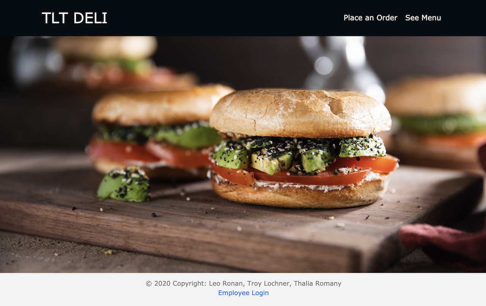

# TLT (Thalia - Leo - Troy) Deli

The TLT is a simple customer & employee facing to-go order application. 

The design is very simple. 

# Customers 
Customers are allowed to visit the site and place a to-go order. They are encouraged to submit their order using their email / phone so that they may receive a notification when their order is ready. (Note : Notifcations are currently disabled - due to secret token issues. )

# Employees
Employees must be logged in to see the status & details of incoming orders. 

